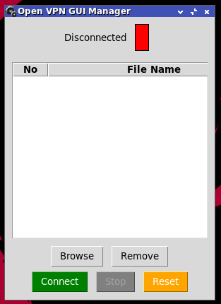

# 🔐 OpenVPN Cert GUI Manager (ovpn-cguim)
OpenVPN Cert GUI Manager is a simple graphical front-end for OpenVPN, made for use cases like playing PPSSPP online on Linux.  
It's built using OpenVPN + Python3 with Tkinter.

# How It Works
The app simplifies OpenVPN commands into button clicks.  
Just select your `.ovpn` certificate file via the **Browse** button, click **Connect**, and minimize.

To disconnect, click **Stop**.  
(This example uses the Retroverse cert, but you can use any other certificate.)
# How to Use

- Make sure you have `openvpn` and `python3-tk` (tkinter) installed.

## Debian / Ubuntu:
```bash
sudo apt install openvpn python3-tk
```

## Void Linux:
```bash
sudo xbps-install -S openvpn python3-tkinter
```

## Arch / Manjaro:
```bash
sudo pacman -S openvpn tk
```

## Solus:
```bash
sudo eopkg install openvpn python3-tkinter
```
## ⚠️ Read This Note
*1. This tool requires root (sudo) access to run OpenVPN connections.**  
*2. You need to turn off the firewall**  
*3. This app is intended for intermediate to advanced Linux users — use at your own risk.**

## 📥 How to Run
- Download the archive:
  https://github.com/DidiSlothStanca/ovpn-cguim/releases

- Open terminal in your Downloads folder and run:
```bash
cd ~/Downloads/
```
```bash
tar -xf ovpn-cguim.tar.gz -C ~/
```
```bash
cd ~/ovpn-cguim/
```
```bash
./ovpncguim.sh
```

(You can also double-click the script to launch it use Pcmanfm)
> NOTE: Make sure the folder `ovpn-cguim/` is located in your **home directory** (`~/`).

## 🔑 Certificate Setup



1. Click the **Browse** button in the GUI  
2. Select your `.ovpn` certificate file  
3. Click **Connect**, then enter your root password when prompted
4. **Stop** for stop connection

If connection is successful, the window will minimize.  
To disconnect, click **Stop**.

Use the **Browse** button to select your certificate file.  
When prompted, enter your root password — OpenVPN needs `sudo` access.

# Reset Button
This button will forcibly stop OpenVPN if it's still running  
after the GUI is accidentally closed or crashes.
```
